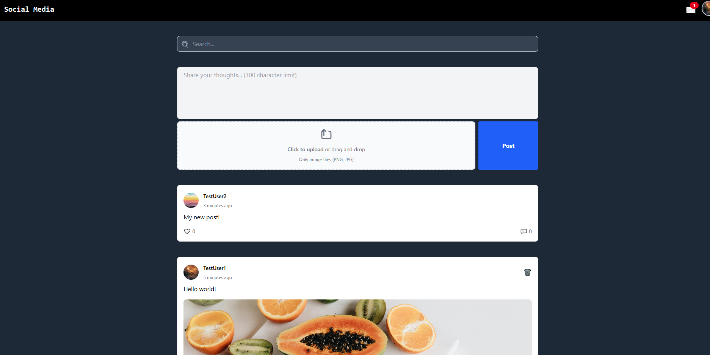
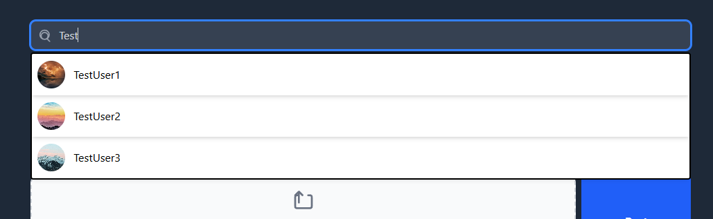
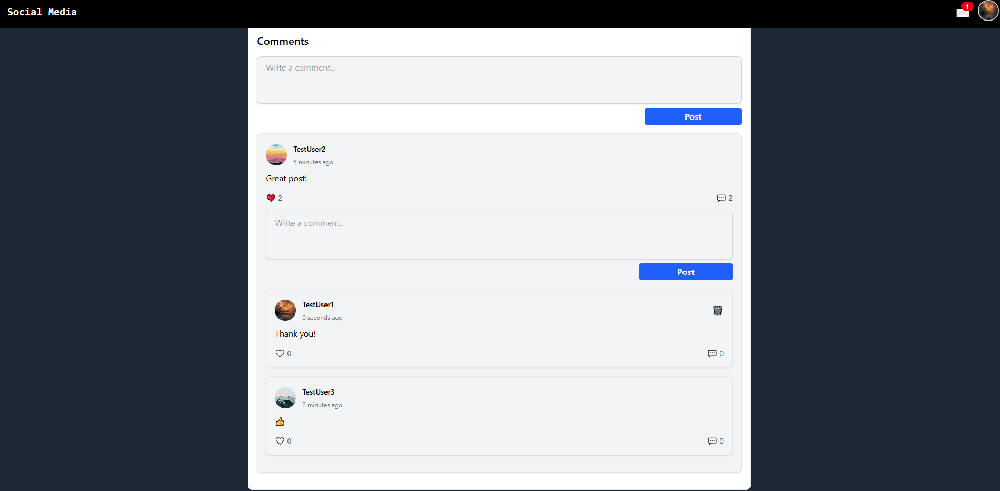
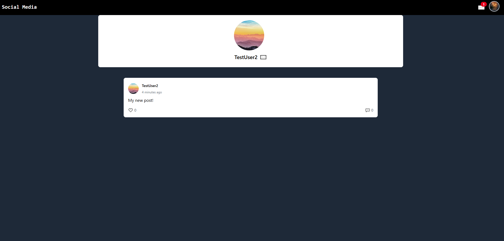
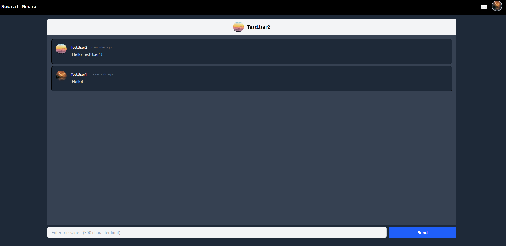
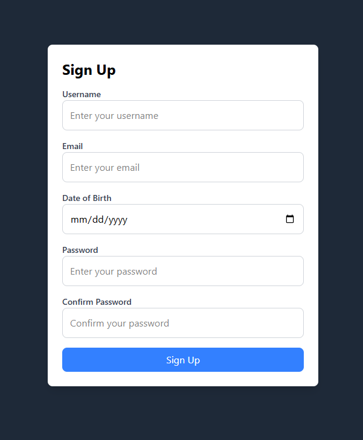

# Webshop 

You can try the project here: https://social-media-lemon-beta.vercel.app/

A modern social media application built with **React**, **Vite**, **TypeScript**, **TailwindCSS** and **Supabase**. It allows users to create an account, make posts, interact with other posts through likes and comments, message other users and more.

## Features
- **User Authentication**: Users can sign up, log in, and log out with email-based authentication.
- **Profile Picture**: Users can upload custom profile pictures.
- **Post Creation**: Users can create posts with text and images.
- **Post Interaction**: Users can like and comment on posts.
- **Messaging**: Users can send messages to other users.
- **Search**: Users can search for other users and posts.
- **Responsive Design**: Adapts to various screen sizes.

## Tech Stack
- **Frontend**: React, Vite, Typescript, TailwindCSS
- **Backend**: Supabase
- **Deployment**: Vercel
- **Version Control**: Git, GitHub

## Screenshots

